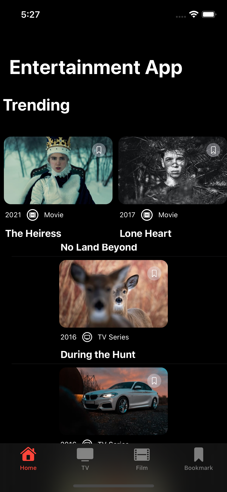
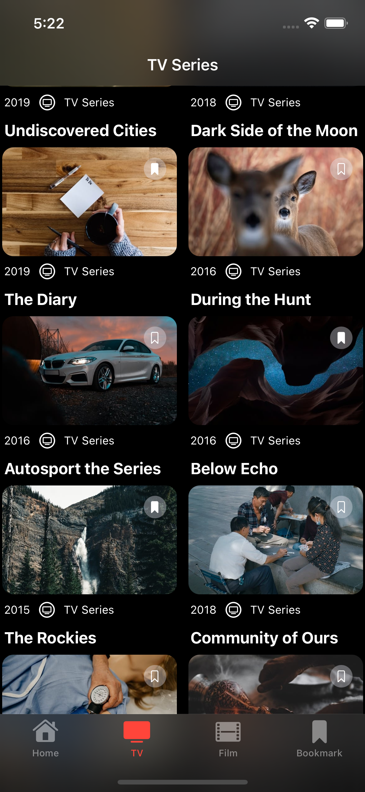
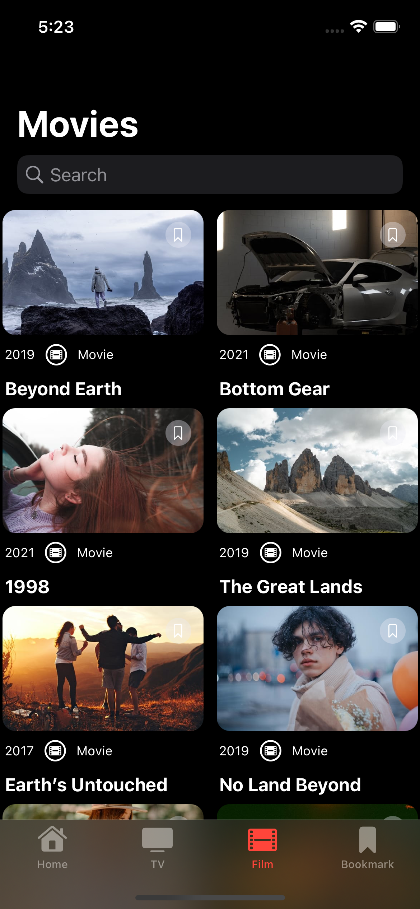
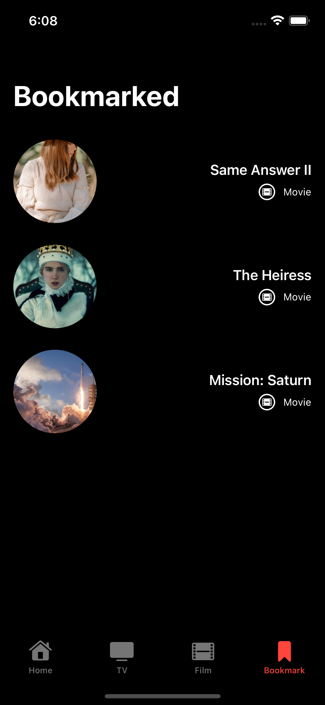

# Frontend Mentor - Entertainment mobile app solution

This is a solution to the [Entertainment web app challenge on Frontend Mentor](https://www.frontendmentor.io/challenges/entertainment-web-app-J-UhgAW1X) 

## Overview

### The challenge

Users should be able to:

- View the optimal layout for the app depending on their device's screen size
- Navigate between Home, Movies, TV Series, and Bookmarked Shows pages. Using tabs
- Add/Remove bookmarks from all movies and TV series
- Search for relevant shows on all pages. I used pull down search bar functionaility

- **Possible Additions**
- **Bonus**: Build this project as a full-stack application
- **Bonus**: If you're building a full-stack app, we provide authentication screen (sign-up/login) designs if you'd like to create an auth flow

### Screenshots

## My process

### Built with

- [SwiftUI](https://developer.apple.com/xcode/swiftui/) - Swift

### What I learned

Using previously knowledge of SwiftUI to tackle this frontendmentor challenge.

### Useful resources

Bakery App to create the icon.

## Author

- Website - [James](https://www.jimcoder-dev.co.uk)

## Acknowledgments